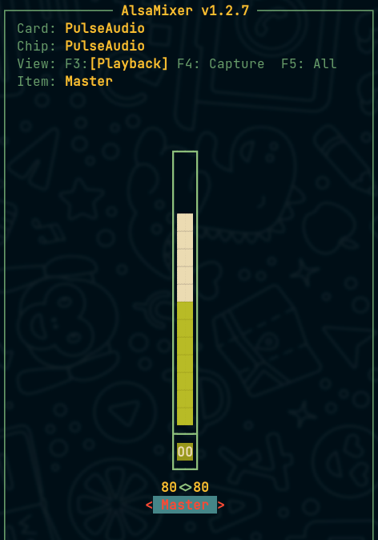
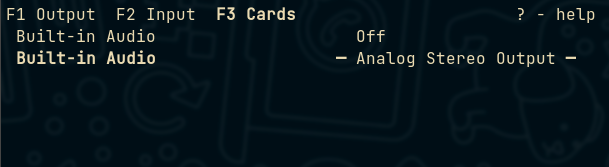

# FIX SOUNDS
-------------
- [Linux: ALSA lib pcm_dmix.c:1108:(snd_pcm_dmix_open) unable to open slave](https://dev.to/setevoy/linux-alsa-lib-pcmdmixc1108sndpcmdmixopen-unable-to-open-slave-38on)

### fix sound work by sudo only
- select `module` (driver)
```bash
\$ cat /etc/modprobe.d/default.conf

options snd_hda_intel index=1
```
- check `alsamixer`
```
\$ alsamixser
```


- choose `builting audio` that not `off` in `pulsemixer`
```
\$ pulsemixer
```



# unmout all, But danger
```bash
\$ amixer scontrols | grep -oE "'.*'" | awk -F\' \
    '{print "amixer -c 0 set \""$2"\" unmute 100"}' >> ~/speaker.txt
```

